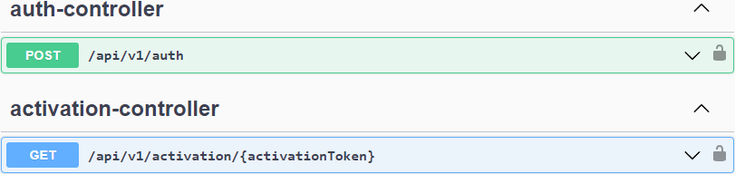

```
# to build the code as a docker image, open a command-line window and execute the following command:
$ mvn clean package dockerfile:build

# to start the docker image, stay in the directory containing the source code and run the following command: 
$ docker-compose -f docker/docker-compose.yml up
```





